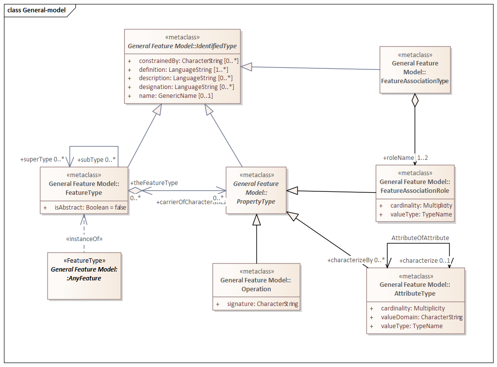
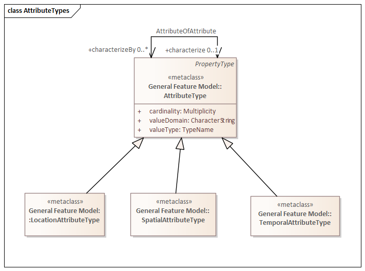

=== Geometry in 3 Dimensions

*Topic:* Is the OGC Geometry model sufficient to support 3D?

==== Feature Model

Before we can discuss geometry, we must first have a conceptual model of the universe. The OGC and ISO TC211 provide that model in ISO 19109. This standard defines the General Feature Model (GFM). The GFM defines the concept of a Feature, its components, and behaviors.

ISO TC211 defines a Feature as an "Abstraction of real world phenomena" (ISO 19101-1:2014)

A Feature, then, is a high level abstraction for anything that does or could exist in the universe. 

The General Feature Model further refines the concept of a Feature. The following principles are most relevant for this discussion:   

. A Feature can be a FeatureType or an Instance of a FeatureType (AnyFeature).
. FeatureTypes can form a taxonomy (inheritance)
. Features possess characteristics (Properties)
. A Property of a Feature can be an Operation, Attribute, or Association.

The resulting model is sufficient to describe a Feature's identity (IdentifiedType), what it is (FeatureType), what it can do (Operations), its observable characterisitics (Attributes), and any associations with other Feature instances.

==== Feature Geometry

The General Feature Model treats geometry as an attribute of the Feature. In addition, it defines three types of attribute which are useful for associating geometry with a Feature in a standard manner: 

* SpatialAttributeType: Geometries (GM_Object) and Topologies (TP_Object)
* LocationalAttributeType: Named locations, extents, and points.
* TemporalAttributeType: Temporal objects (TM_Object)

image::./images/SpatialAttributeType.png[]

image::./images/LocationalAttributeType.png[]

image::./images/TemporalAttributeType.png[]

In our discussion of Dynamic Features, we must allow for Features which are moving through three dimensions and have non-trivial three dimensional shapes. We must also consider that the shape of these objects may change with time. From this we see that the movement of the Feature and the shape of the Feature are two separate properties. 

A measurement of movement would capture changes in location and orientation. Movement is in the eyes of an external observer. Therefore, movement should be specified using a coordinate reference system which is external to the Feature.

The shape of a Feature is independent of its location. A rigid body has the same shape regardless of where it is or who is observing it. It's geometry should be self-contained. This requires use of an internal coordinate reference system.

This leads up to two postulates:

Postulate 1: The Locational Attribute of a 3D Feature is a GM_Point which locates the origin of the local CRS within an <<external_coordinate_reference_system_definition,external CRS>>.

Postulate 2: The Spatial Attribute of a 3D Feature is one or more GM_Objects which define the shape of the Feature in the <<local_coordinate_reference_system_definition,local coordinate refrence system>>.

One and two dimensional geometries are well understood. So the locational attribute poses few immediate problems. Three-dimensional shapes are another matter. Particularly if they are free from any bounding surface and capable of movement.

NOTE: The Locational attribute only specifies the location of the Local CRS. It does not address the orientation of that CRS.

==== 3D Geometry

The applicable OGC/ISO standard for 3D geometries is ISO 19107:2003. While a new version was approved in 2019, it hasn't propagated through the rest of the ISO standards baseline. As a result, 19107:2003 is the most recent implemented version. 

ISO 19107 defines both the GM_Object and GM_Boundary classes as root level geometry classes. The association between GM_Object and GM_Boundary is achieved through the “boundary()” operation on the GM_Object class.

image::./images/Geometry_3D.png[]

Therefore, we can describe the shape of a Feature in terms of the space occupied by that Feature and the boundary which encloses that space.

Postulate 3: A 3D Feature is a Feature who's geometry is defined by a volume enclosed by a boundary surface.

NOTE: CityGML 3.0 is a good example of the use of 3D geometries.

===== Volumetrics

GM_Object is subclassed into GM_Primitive then into GM_Solid.  The “volume()” operation on GM_Solid returns the volume (defined in ISO 19103) associated with a Feature. Thus, ISO 19107 supports the concept of a 3D volume.

Real 3D objects are often not solid. So the 3D model must also support voids, or even entire 3D Features within their interior. GM_Primitive addresses this need through the “interior to” association. The two roles on this association are the containingPrimitive (the GM_Primitive which contains another GM_Primitive) and the containedPrimitive (the GM_Primitive which is contained). This association has proven its worth in 2D space so there is little doubt that it will be just as effective in 3D.

===== Boundaries

A 3D volume is delineated by a bounding surface.  GM_Boundary is the root class for boundaries. The subclass GM_PrimitiveBoundary provides the boundary for GM_Primitives. The GM_PrimitiveBoundary subclass GM_SolidBoundary is defined as the boundary for a GM_Solid.

image::./images/Boundary_3D.png[]

ISO 19107 goes even farther. A GM_SolidBoundary is composed of both interior and exterior boundaries. These boundaries are defined by the GM_Shell class. Following the class associations we see:

* A GM_Shell is a GM_CompositeSurface
* A GM_CompositeSurface is composed of
GM_OrientablePrimitives
* A GM_Surface is a type of GM_OrientablePrimitive
* A GM_PolyhedralSurface is a type of GM_Surface
* A GM_PolyhedralSurface can be composed of
GM_Polygons 

A surface constructed of polygons is an example of Boundary Representation (B-Rep) of a surface. This approach is fundamental to rendering 3D computer graphics. (ref Adam Powers 1981)

====== Closure Surfaces

Some structures, such as a tunnel or overpass, pose difficulties for this geometry model. The boundary surface can be constructed so that it continues into the interior of the structure. That would make the interior of a tunnel external to the tunnel object. This is not always a desireable result. CityGML provides the concept of a "Closure Surface".

A Closure Surface is a surface which is a logical part of the object but does not correspond to a physical part of the object. For example, the entrance to a tunnel can have a closure surface. This surface allows you to treat the tunnel as a three-dimension solid, even though there is a hole in the bounding surface. 

image::./images/Closure_Surface.png[]

As implemented in CityGML 3.0, the ClosureSurface class has quite an ancestory. We may want to generalize this concept for use outside of CityGML. However, the capabilties provided by the ancestor classes do provide value and may be worth incorporating into a general 3D model.

====== B-Rep

The polyhedral surfaces which bound volumetric shapes are similar to the Boundary Representation (B-Rep) approach used in CAD and computer graphics. B-Rep defines a 3-dimensional surface which serves as the interface between the interior of the volumetric shape and the exterior. This surface is usually defined by a collection of shape elements (polygons) which together form a closed surface. 

https://en.wikipedia.org/wiki/Boundary_representation

====== Point Clouds

Boundary surfaces can also be defined using 3D point clouds. This allows the spatial represention a bounding surface by a set of points located on that surface. In this way, the geometry of a Feature could, for instance, be modelled directly from the result of a mobile laser scanning campaign. 

