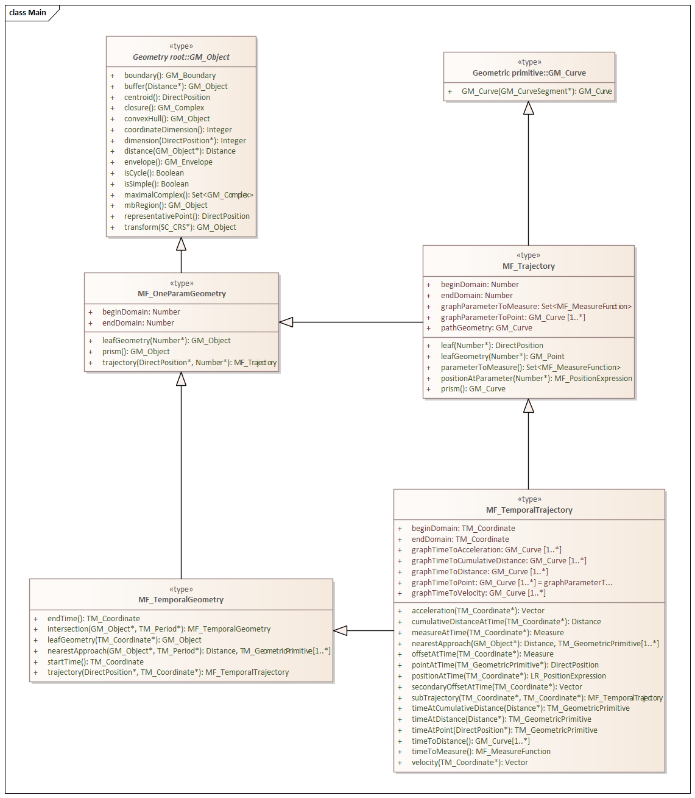

=== Temporal Geometry

Proposition: We have sufficient standards to define geometries which change with time.

==== ISO 19141 - Moving Features

"ISO 19141:2008 defines a method to describe the geometry of a feature that moves as a rigid body."

But a look at 19141 suggests much more than that.  

MF_TemporalGeometry

MF_TemporalGeometry is a specialization of MF_OneParamGeometry in which the parameter is time as expressed by TM_Coordinate.  TM_Coordinate is specified in ISO 19108; it expresses time as a multiple of a single unit of measure such as year, day, or second.

MF_OneParameterGeometry

A one parameter set of geometries is a function f from an interval t Î [a, b] such that f(t) is a geometry and for each point P Î f(a) there is a one parameter set of points (called the trajectory of P) P(t) : [a, b] ® P(t) such that P(t) Î f(t). A leaf of a one parameter set of geometries is the geometry f(t) at a particular value of the parameter. The set of geometries forms a prism that is the set of points in the union of the geometries (or the union of the trajectories).  

The type "MF_OneParamGeometry" acts as the root classifier for all geometric object classified as one parameter sets of geometric objects. As a one-paramter set, they have "leaf" projections ( for each parameter value.  As geometric objects they act as the infinite union of all their "leaf" (cross sections for each parameter value).

So if our object it defined by a bounding surface, and that surface is made up of a number of shapes descended from MF_TemporalGeometry, then the surface geometry of our object can change over time. Hence it is not rigid. ISO 19141, when used with CityGML, can also define deforming (plastic) bodies.
