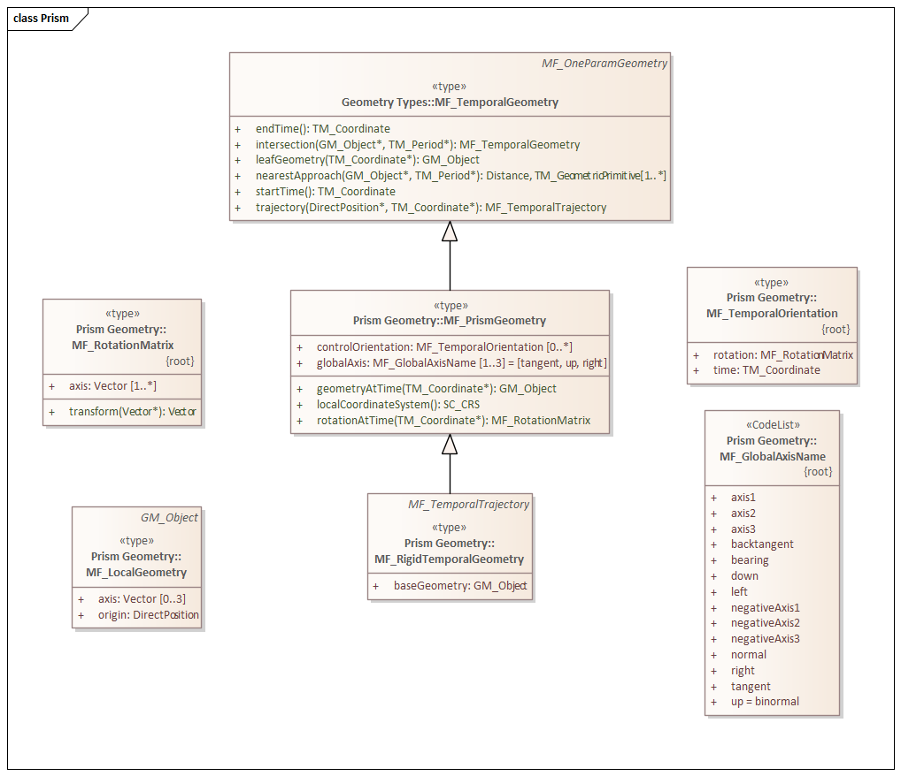

=== Moving Features

*Topic:* Is the OGC geometry model sufficient to support 3D?

ISO 19141 is the standard for Moving Features. It introduces the concept of Feature Properties whose values are a function of an input parameter.

image::images/Movement.png[]

==== Basic Concepts

*Volume and Boundary surface*

ISO 19107 provides us with the GM_Object and GM_Boundary classes. GM_Object represents the space that is occupied by a geometry. GM_Boundary represents a surface which forms the boundary between inside and outside of the associated GM_Object. GM_Object and GM_Boundary are both specialized according to the number of dimensions they support. 

*Location and shape*

The location of a Feature is a single GM_Point which represents its current position in the universe. GM_Point is a geometry of zero dimensions, but is specified with values of all of the applicable coordinate axis. 

The Shape of a Feature is the bounding geometry. Shape tells you nothing about where a Feature is but does specify the volume of the space it occupies. 

*Global and Local coordinate systems*

image::images/LocalGlobalCRS.png[]

Moving Features deal with two coordinate system. The Global (external) coordinate system is defined for the area external to the Feature. It is mostly used to identify the loctation and orientation of the Feature.

The local coordinate system is internal to the Feature. This is usually a cartisian coordinate system with the origin at a prominant point in the Feature such as the center of mass. The origin of the local coordinate system should also be the point where location is measured.

==== MF_OneParameterGeometry

We start our discussion with the class MF_OneParameterGeometry. MF_OneParameterGeometry is a subclass of GM_Object. So moving features have the 3D geometric properties of any other GM_Object. What is different is that this geometry can change as a function of a parameter. 
A one parameter set of geometries is defined as "a function f from an interval t Î [a, b] such that f(t) is a geometry and for each point P Î f(a) there is a one parameter set of points (called the trajectory of P) P(t) : [a, b] ® P(t) such that P(t) Î f(t). A leaf of a one parameter set of geometries is the geometry f(t) at a particular value of the parameter". 

A one parameter geometry instance includes a "leafgeometry()" operation. This operation takes the parameter (t) as input and returns the leaf P(t) for that parameter as a GM_Object.   

==== MF_TemporalGeometry

An MF_TemporalGeometry is a MF_OneParameterGeometry where the parameter is Time expressed as a TM_Coordinate. TM_Coordinate is specified in ISO 19108; it expresses time as a multiple of a single unit of measure such as year, day, or second. The "leafgeometry()" operation of an instance of MF_TemporalGeometry would take a TM_Coordinat in as input and return a GM_Object instance representing the geometry of the Feature at the specified point in time.

==== Temporal Properties

The JSON encoding of the OGC Moving Features standard introduces the concept of temporal properties. 

"A TemporalProperties object is a JSON array of ParametricValues objects that groups a collection of dynamic non-spatial attributes and its parametric values with time."

Logically TemporalProperties should be a subclass of OneParamProperties. Since Geometry is a property, then MF_TemporalGeometry should be a subclass of TemporalProperties. Which gives us the following UML.

image::images/Temporal_Properties.png[]

Temporal properties are particularly useful for capturing state change. For example, the fuel load of an aircraft will change over time. The leafproperty() operation on a temporal fuel_load object would return the amount of fuel onboard at the specified time.

==== MF_TemporalTrajectory

A trajectory is a GM_Curve which represents the positions a Moving Feature has or is expected to occupy. A Temporal Trajectory supports operations which will report the properties of the Moving Feature at a specific time. The geometry property is restricted to GM_Point.

image::images/MF_Trajectory.png[]

==== MF_PrismGeometry

image::images/Foliation.png[]

A leaf represents the geometry of a Feature as a function of time

Each point in the bounding surface is traced across leafs using a temporal trajectory

The space occupied by the Feature over time, the sum of all of the leaf geometries, is a Prism.

A collection of leafs is a foliation.

. A leaf is the same in both the prism and trajectory model. The difference is in the numbmer of dimensions allowed
. A prism can be viewed as a volume enclosed by a surface defined by a collection of trajectories

This gives up two alternatives. A leaf can store the full geometry as it exists at the specified time. Or, a leaf can generate the geometry from the collection of trajectories.

In the first case, the full geometry must be represented in each leaf whether or not it has changed. However, it is most easily represented in local coordinate space so that only actual changes in the shape have to be captured.

In the second case intermediate geometries do not have to be captured. The values at a specific time can be calculated from the trajectory curve. However, for a moving feature it becomes necessary to update all fo the trajectories whenever the feature changes location.

GeometryAtTime(): The operation "geometryAtTime" shall accept a time in the domain of the prism geometry and return the geometry of the moving feature, as it is at a given time in the global coordinate reference system. This shape might be a realistic rendition of the object, or it may be an iconized rendition of the type of object, as needed by the application. For example, in a simulation a truck might be represented as an icon as opposed to a photorealistic rendition. This allows the application to use the local geometry to convey information such as certainty of identification or feature status through the use of appropriate icons and other portrayal parameters. 

*RotationAtTime():* The operation "rotationAtTime" shall accept a time in the domain of the prism geometry and return the rotation matrix that embeds the local geometry into geographic space at a given time (TM_Coordinate). The vectors of the rotation matrix allow the feature to be aligned and scaled as appropriate to the vectors of the global "map" coordinate reference system. Because scale may change in complex ways as a feature moves with respect to a projected coordinate reference system, the rotation matrix may also contain scale factors.

*LocalCoordinateSystem():* The operation "localCoordinateSystem" shall return a SC_CRS for the design coordinate reference system in which the moving feature's shape is defined.

*BaseGeometry Attribute:* The attribute "baseGeometry" is the geometry of the moving object in a local rectangular coordinate reference system based on the axis of the object. The object should have a natural up, front and right (cross product of up and front). If the representation to be used is not "centred" on its origin, the application should use an MF_LocalGeometry (7.3) subclass to create a local origin.

==== Rigid vs. Plastic

ISO 19141:2008 states that it "defines a method to describe the geometry of a feature that moves as a rigid body."

That may not be a limitation in fact. If our object iS defined by a bounding surface, and that surface is made up of a number of shapes descended from MF_TemporalGeometry, then the surface geometry of our object can change over time. Hence it is not rigid. ISO 19141 can also define deforming (plastic) bodies.

ISO 19141 Section 5.1

A moving feature can be modelled as a combination of movements. The overall motion can be expressed as the temporal path or trajectory of some reference point on the object (the “origin”), such as its center of gravity. Once the origin’s trajectory has been established, the position along the trajectory can be described using a linear reference system (as defined in ISO 19133). The “parameterization by length” for curves (as defined in ISO 19107) can be used as a simple linear reference if no other is available. The relationship between time (t) and measure value (m) can be represented as the graph of the t→ m function in a plane with coordinates (t, m). This separation of the geometry of the path and the actual “time to position” function allows the moving feature to be tracked along existing geometry.

Figure 1 illustrates how the concepts of foliation, prism, trajectory, and leaf relate to one another. In this illustration, a 2D rectangle moves and rotates. Each representation of the rectangle at a given time is a leaf. The path traced by each corner point of the rectangle (and by each of its other points) is a trajectory. The set of points contained in all of the leaves, and in all of the trajectories, forms a prism. The set of leaves also forms a foliation.

image::images/Foliation.png[]

These two object representations, of the path and the position along that path, give the general position of the moving feature. The other variable in describing the position of the feature is the rotation about the chosen reference point. To describe this, a local engineering coordinate system is established using the object reference point as its origin. The geometry of the feature is described in the engineering coordinate system and the real-world orientation of the feature is given by mapping of the local coordinate axes to the global coordinate system (the CRS of the trajectory of the reference point). This can be given as a matrix that maps the unit vectors of the local coordinate system to vectors in the global CRS.

If the global CRS and local CRS have the same dimension, then each point within the local CRS can be traced in time through the global CRS by combinations of these various mappings. The map would trace from time (t) to the measure (m) to a position on the reference point's path using the LRS. Then using the rotation matrix, the calculated offset from this point gives a direct position in the global CRS.

This means that the ‘prism’ of the moving feature (defined as all the points which part of the feature passes through) can be viewed (and calculated to whatever degree of accuracy needed) as a bundle of trajectories of points on the local engineering representation of the feature's geometry. If viewed in a 4 dimensional spatiotemporal coordinate system, the points on the feature at different times are different points. Then the preimage of the prism (points on the trajectories augmented by a time coordinate) is a foliation, meaning that there is a complete and separate representation of the geometry of the feature for each specific time (called a “leaf”). These names come from a 3D metaphor of a book, where each page or leaf is a slice of time in the “folio”.

This might form the basis for an extension of this standard to non-rigid, mutable objects. Each leaf in the 4D foliation is a separate representation of the object, and by creating methods to describe the change through time of the shape and form of the feature, the existing machinery in this International Standard can be used to place those representations in positions with respect to the global coordinate system.