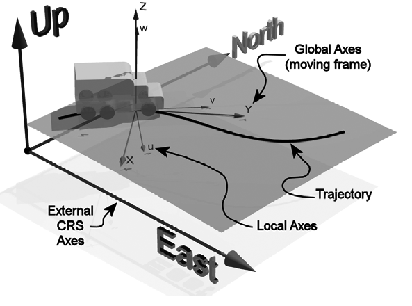
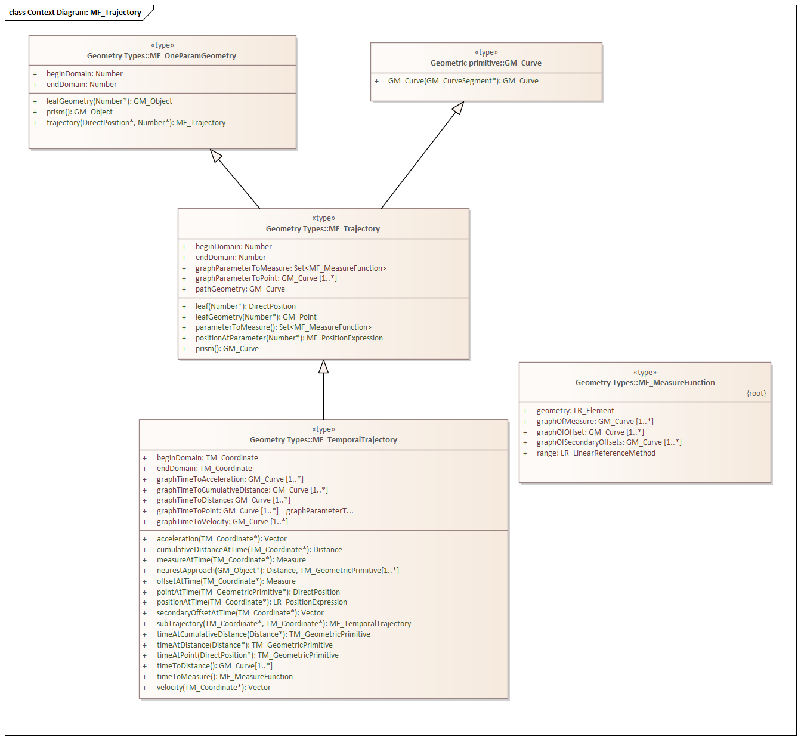

=== Moving Features

*Topic:* Is the OGC geometry model sufficient to support 3D Moving Features?

The ISO Standard for Moving Features is ISO 19141:2008. This standard extends the geometry model from ISO 19107 and, by association, the Feature Model from ISO 19109.

image::./images/Movement.png[]

A high level view of ISO 19141 is provided in Figure --. The classes identified in this figure are described below. But first, a discussion of coordinate reference systems (CRS) is in-order. 

==== Coordinate systems

Moving Features deal with three spatial coordinate systems as well at one temporal coordinate system. The spatial coordinate systems are referred to as the External, Global, and Local CRS.

When dealing with Moving Features, we frequently need to convert coordinates between the three spatial CRS. The GM_Object class provides us with the transform() operation which can be used for this purpose.  

===== External CRS

The External coordinate system is the coordinate system within which the Moving Feature exists. Typically this is an Earth-centric geographic CRS.

===== Global CRS

The Global coordinate system is a moving CRS which describes the area external to the Feature at a specific time. Typically the origin is the location of the Feature on the trajectory and the principal axis is the tangent to the trajectory at that point.

===== Local CRS

The local coordinate system is internal to the Feature. This is usually a cartisian coordinate system with the origin at a prominant point in the Feature such as the center of mass. The origin of the local coordinate system should also be the point where the location and orientation of the Feature is measured.

===== Temporal Reference Systems

ISO 19108:2006 Geographic Schema - Temporal Schema is the ISO standard for Temporal Reference Systems. In particular, the TM_ReferenceSystem class. 

TM_ReferenceSystem has two attributes; `domainOfValidity` and `name`. The `name` attribute is an identifier for this temporal reference system. The `domainOfValidity` specifies the spatial extent over which this TRS is applicable. 

TM_ReferenceSystem is specialized through a number of subclasses. The two most relevant to this paper are TM_CoordinateSystem and TM_Clock.

TM_CoordinateSystem is "A system for measuring time on a continuous interval scale using a single standard time interval". The standard time interval is provided through the `interval` attribute. In addition, the `origin` attribute provides a temporal "datum" from which time is measured. Since time is a one-dimensional quantity, the origin and interval are sufficient to define a basic Temporal Coordinate Reference System.

TM_Clock is "A system for measuring temporal position within a day". It has an optional `dateBasis` association with a calendar (TM_Calendar).

This combination of classes allows us support high precision local-clock TRS as well as full date-time TRS.

==== Coordinate Representation

The coordinates used to define a 3D moving geometry (MG) face requirements specific to their use. These requirements are derived from two characteristics of moving geometries. Unlike static spatial geometries, time and location in moving geometries are tightly coupled. They must act as a single, four dimension location. In addition, there will be a large number of coordinate measurements. This is a result of the need to accuratly track movement over time.  

. A MF coordinate must represent a discrete location in space and time.
. A MF coordinate must include values for all three spatial axis (X,Y,Z) as well as the temporal axis (t).
. A MF coordinate must be concise. 

Of the Moving Feature encoding standards, the JSON encoding comes closest to meeting these requirements. Its major shortfall is the need for conformance with GeoJSON. Since GeoJSON assumes a terrestrial spatial geometry, spatial and temporal coordinates must be encoded separately.  

* A LinearTrajectory object SHALL be a GeoJSON Feature object that has two MANDATORY members of "geometry" and "properties".

The spatial locations are captured using the GeoJSON "geometry" property. This property is restricted as follows:

* The value of the "geometry" member SHALL be a LineString Geometry object, having "type" = "LineString".
* The number of elements in the array of the "coordinates" value in the Geometry object SHALL more than two positions.

So the spatial geometry is a linestring of more than two points.

GeoJSON does no support temporal coordinates directly. So the "properties" property is adapted for this purpose. Since "properties" is not limited to temporal coordinates, these requirements are more complex. 

* The value of the "properties" member SHALL be a GeoJSON object that has at least a member with the named "datetimes".
* The value of the "datetimes" member is a JSON array. 
* Each element in the array of the "datetimes" value SHALL be an instant object.
* An instant object SHALL be only a JSON string to represent a timestamp encoded by the IETF RFC 3339 format using ``Z`` or
the numeric value of milliseconds since midnight (00:00 a.m.) on January 1, 1970, in UTC.
* The array of the ``"datetimes"`` value SHALL be a monotonic increasing sequence.
* There SHALL be no instant object that has the same value as any other element.

The consequence of these requirements is that the "properties" property can carry the temporal equivalent to a line string. There is one final requirement. 

* The number of elements in both arrays of the "coordinates" value and the "datetimes" value SHALL be equal.

So there is a one-to-one correspondance between the temporal measurements in the "properties" property and the spatial measurements in the "geometry" property. 

An example of this encoding is provided ---

    {
        "type": "Feature",
        "id": "A",
        "geometry": {
            "type": "LineString",
            "coordinates": [[11.0,2.0,50.0], [12.0,3.0,52.0], [10.0,3.0,56.0]]
        },
        "properties": {
            "datetimes": ["2012-01-17T12:33:51Z", "2012-01-17T12:33:56Z", "2012-01-17T12:34:00Z"],
            "state": ["walking", "walking"],
            "typecode": [1, 2]
        }
    },

==== Geometry

===== MF_OneParameterGeometry

We start our discussion with the class MF_OneParameterGeometry. MF_OneParameterGeometry is a subclass of GM_Object. So moving features have the 3D geometric properties of any other GM_Object. What is different is that this geometry can change as a function of a parameter.

A one parameter set of geometries is defined as "a function f from an interval t Î [a, b] such that f(t) is a geometry and for each point P Î f(a) there is a one parameter set of points (called the trajectory of P) P(t) : [a, b] ® P(t) such that P(t) Î f(t). A leaf of a one parameter set of geometries is the geometry f(t) at a particular value of the parameter". 

A one parameter geometry instance includes a "leafgeometry()" operation. This operation takes the parameter (t) as input and returns the leaf P(t) for that parameter as a GM_Object.   

===== MF_TemporalGeometry

An MF_TemporalGeometry is a MF_OneParameterGeometry where the parameter is Time expressed as a TM_Coordinate. TM_Coordinate is specified in ISO 19108; it expresses time as a multiple of a single unit of measure such as year, day, or second. The "leafgeometry()" operation of an instance of MF_TemporalGeometry would take a TM_Coordinate in as input and return a GM_Object instance representing the geometry of the Feature at the specified point in time.

===== Temporal Properties

The JSON encoding of the OGC Moving Features standard introduces the concept of temporal properties. 

"A TemporalProperties object is a JSON array of ParametricValues objects that groups a collection of dynamic non-spatial attributes and its parametric values with time."

Logically TemporalProperties should be a subclass of OneParamProperties. Since Geometry is a property, then MF_TemporalGeometry should be a subclass of TemporalProperties. Which gives us the following UML.

image::./images/Temporal_Properties.png[]

Temporal properties are particularly useful for capturing state change. For example, the fuel load of an aircraft will change over time. The leafproperty() operation on a temporal fuel_load object would return the amount of fuel onboard at the specified time.

==== Location

ISO 19141 represents the location of a Moving Feature using two classes; MF_Trajectory and MF_TemporalTrajectory. 

A MF_Trajectory is a curve (GM_Curve). It represents every postion that the Feature has occupied during it's journey. It does not necessarily represent the time when each location was reached. 

MF_TemporalTrajectory makes the MF_Trajectory a MF_TemporalGeometry. It represents location along the trajectory as a function of time. So each location is fully defined in both space and time.   

A Temporal Trajectory has two operations of particular interest; leaf() and leafgeometry(). The input parameter for these operations is always time (TM_Coordinate).  

The leaf() operation returns the spatial location (Direct_Position) that the Moving Feature passes at the time (TM_Coordinate) specified by the input parameter. This is a point on the trajectory GM_Curve geometry. It also serves as the origin of the Global CRS at that location on the trajectory.   

The LeafGeometry() operation returns the spatial geometry (GM_Point) that is Moving Feature passes at the time (TM_Coordinate) specified by the input parameter. This is the geometry of the Moving Feature expressed in the Local CRS. Since Trajectories only convey location, only GM_Point geometries are supported.

==== Orientation

===== MF_PrismGeometry

If an application focuses on only the linear movement (i.e., the spatiotemporal line string) of moving points based on World Geodetic System 1984, with longitude and latitude units of decimal degrees, and the ISO 8601 standard for representation of dates and times using the Gregorian calendar, the application can share the trajectory data by using **only** IETF GeoJSON, called **MF-JSON Trajectory**. For other cases, **MF-JSON Prism** can be used for expressing more complex movements of moving features. **MF-JSON Prism** is a GeoJSON-like format reserving new members of JSON objects (`"temporalGeometry," "temporalProperties," "crs," "trs," "time," and others) as "foreign members" to represent spatiotemporal geometries, variations of measure, coordinate reference systems, and the particular period of moving features in a JSON document.

A trajectory provides the location of a Moving Feature as a function of time. Prism Geometry represents the full geometry (location, orientaion, and shape) of the Feature as a function of time. 

image::./images/Foliation.png[]

The key concepts in the Prism model are:

*Leaf:* A leaf is the geometry of the Moving Feature at time (tn).  

*Foliation:* A collection of leaves where there is a complete and separate representation of the geometry of the Feature for each specific time (tn).

*Trajectory:* A curve that represents the path of a point in the geometry of the Moving Feature as it moves with respect to time (t).

*Prism:* the union of the geometries (or the union of the trajectories) in a foliation.

Like a Temporal Trajectory, a Prism is a subclass of MF_TemporalGeometry. 

image::./images/Prism_Context.png[]

A MF_PrismGeometry class has the following characteristics.

The association role "originTrajectory" associates a Temporal Trajectory with a Prism. For any TM_Position, the associated Temporal Trajectory provides the location of the Moving Feature in the Global CRS. This point serves as the origin of the Local CRS.

The localCoordinateSystem() operation returns a SC_CRS for the design coordinate reference system in which the moving feature's shape is defined.

The rotationAtTime() operation accepts a time in the domain of the prism geometry and returns the rotation matrix that embeds the local geometry into geographic space at a given time (TM_Coordinate). The vectors of the rotation matrix allow the feature to be aligned and scaled as appropriate to the vectors of the global coordinate reference system.

This one association and two operations provide us with the location, orientation, axis definition, and units of measure needed to define identify the local CRS and to transform geometries between the Local and Global CRS.

Finally, the geometryAtTime() operation accepts a time in the domain of the prism geometry and returns the geometry of the moving feature, as it is at a given time in the global coordinate reference system. The return type is a GM_Object so this operation is not limited to points. It is fully capable of representing a 3D surface and volume.

In short, a MF_PrismGeometry provides us with the shape, location, and orientation of a Moving Feature as a funtion of time (tn).

==== Non-rigid Bodies

ISO 19141 only addresses rigid bodies. The shape returned by a geometryAtTime() operation will always be the same. However, it leaves open the opportunity to extend the Moving Feature model to support plastic (non-rigid) objects.

The most obvious approach is to allow the geometry returned by the geometryAtTime() operation to change as a function of time. This doesn't require a change to the model. But it may require some changes to the standard.

As a correlary to this approach, the geometry itself could include MF_TemporalGeometry elements. These elements would each have their own lifespan. A history of their movement, in respect to the local CRS, over time.
