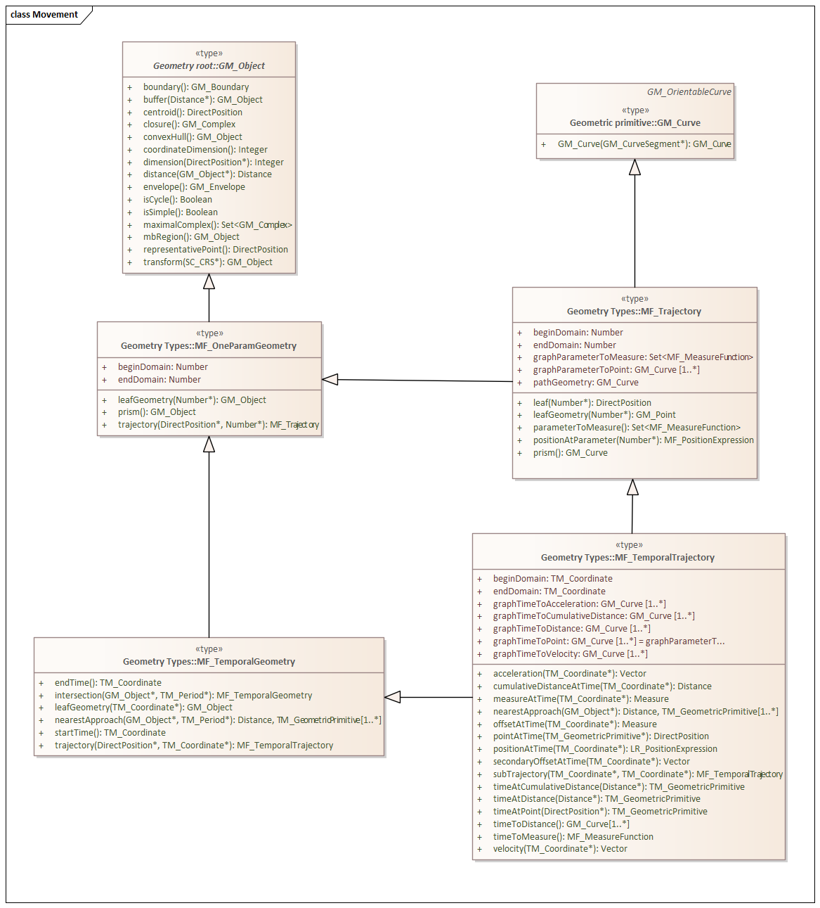

=== Moving Features

*Topic:* Is the OGC geometry model sufficient to support 3D?

==== Parameter based Properties

ISO 19141 is the standard for Moving Features. It introduces the concept of Feature Properties whose values are a function of an input parameter.

*MF_OneParameterGeometry*

We start our discussion with the class MF_OneParameterGeometry. MF_OneParameterGeometry is a subclass of GM_Object. So moving features have the 3D geometric properties of any other GM_Object. What is different is that this geometry can change as a function of a parameter. 
A one parameter set of geometries is defined as "a function f from an interval t Î [a, b] such that f(t) is a geometry and for each point P Î f(a) there is a one parameter set of points (called the trajectory of P) P(t) : [a, b] ® P(t) such that P(t) Î f(t). A leaf of a one parameter set of geometries is the geometry f(t) at a particular value of the parameter". 

A one parameter geometry instance includes a "leafgeometry()" operation. This operation takes the parameter (t) as input and returns the leaf P(t) for that parameter as a GM_Object.   

*MF_TemporalGeometry*

An MF_TemporalGeometry is a MF_OneParameterGeometry where the parameter is Time expressed as a TM_Coordinate. TM_Coordinate is specified in ISO 19108; it expresses time as a multiple of a single unit of measure such as year, day, or second. The "leafgeometry()" operation of an instance of MF_TemporalGeometry would take a TM_Coordinat in as input and return a GM_Object instance representing the geometry of the Feature at the specified point in time.

*Temporal Properties*

The JSON encoding of the OGC Moving Features standard introduces the concept of temporal properties. 

"A TemporalProperties object is a JSON array of ParametricValues objects that groups a collection of dynamic non-spatial attributes and its parametric values with time."

Logically TemporalProperties should be a subclass of OneParamProperties. Since Geometry is a property, then MF_TemporalGeometry should be a subclass of TemporalProperties. Which gives us the following UML.

image::images/Temporal_Properties.png[]

Temporal properties are particularly useful for capturing state change. For example, the fuel load of an aircraft will change over time. The leafproperty() operation on a temporal fuel_load object would return the amount of fuel onboard at the specified time.

==== Rigid vs. Plastic

ISO 19141:2008 states that it "defines a method to describe the geometry of a feature that moves as a rigid body."

That may not be a limitation in fact. If our object iS defined by a bounding surface, and that surface is made up of a number of shapes descended from MF_TemporalGeometry, then the surface geometry of our object can change over time. Hence it is not rigid. ISO 19141 can also define deforming (plastic) bodies.

