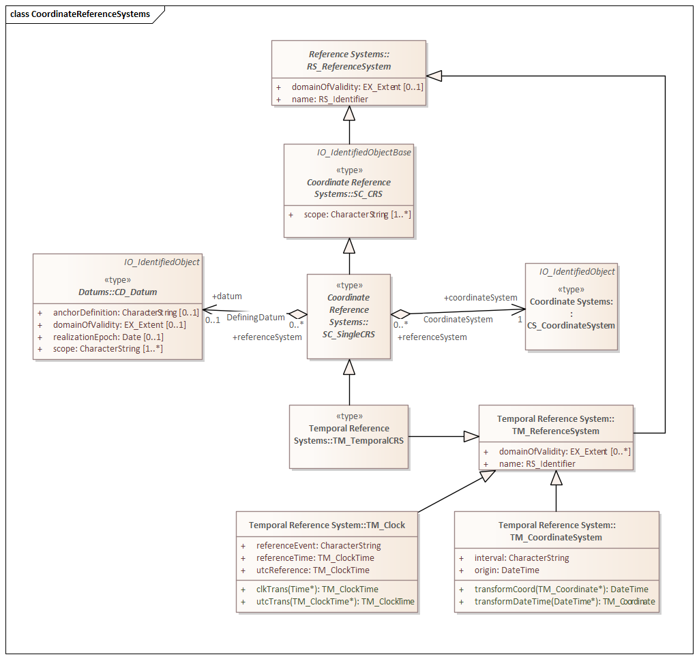
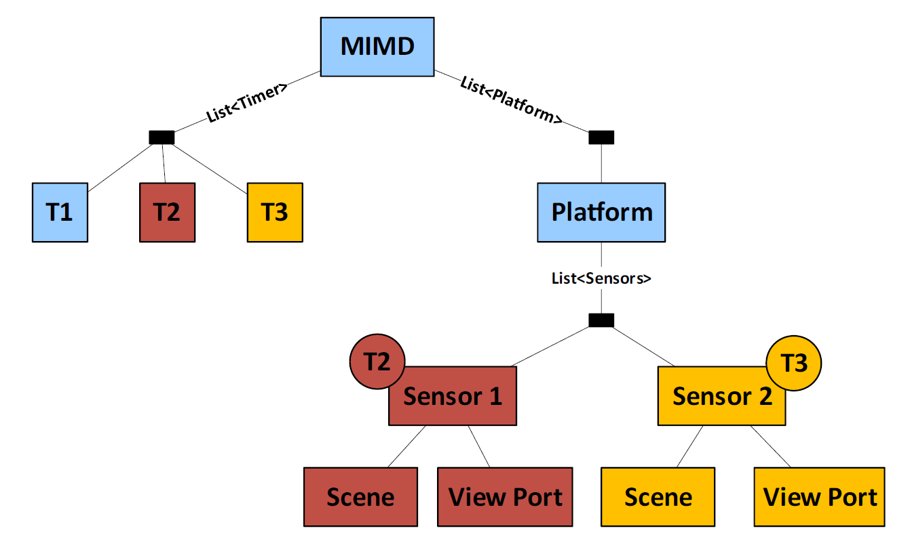

[[temporal_reference_systems_section]]
=== Temporal Reference Systems

Proposition: Time is in the eye of the beholder.  So all measurements of time must be local.

Dynamic Features are not tied to an Earth-centered static existance. Yet the concepts of time used in the geospatial community are almost exclusivly based on Earth-centric astronomical phenomena. They also assume a rather coarse (days, weeks, years) degree of granularity. For dynamic features we need to use local clocks with precision down to the nanosecond. We are less concerned with absolute time than with relative time. State B was achieved 37 nanoseconds after State A.  

It's only when we begin aggregating these dynamic elements that we begin to worry about "absolute" time. Even then, we are more likely to convert from one local clock to another than to convert to an absolute time. 

So if all time is local, we need a Temporal Reference System concept which captures the parameters needed to transform across TRSs. A temporal equivalent to GeoPOSE.

==== ISO 19108

The ISO standard for Temporal Reference Systems is ISO 19108:2006 Geographic Schema - Temporal Schema.

In our discussion of <<moving_features_section,Moving Features>>, we found that time-variant properties of Features were selected using a TM_Coordinate parameter. TM_Coordinate is defined in ISO 19108 and illustrated in Figure ---

image::./images/TM_Coordinate.png[]

From this fiqure we see that a TM_Coordinate is a type of TM_TemporalPosition. And that each TM_TemporalPosition is associated with the TM_ReferenceSystem within which it is measured. So to understand Temporal Reference Systems as defined in ISO 19108, we must explore the capabilites and limits of TM_ReferenceSystem. 

image::./images/TM_ReferenceSystem.png[]

We see from Figure -- that there are four types of TM_ReferenceSystems. Since our concern is with time, not date, the TM_CoordinateSystem and TM_Clock variants are of most interest.

image::./images/TM_CoordinateSystem.png[]

TM_CoordinateSystem is "A system for measuring time on a continuous interval scale using a single standard time interval". The standard time interval is provided through the `interval` attribute. In addition, the `origin` attribute provides a temporal "datum" from which time is measured. Since time is a one-dimensional quantity, the origin and interval are sufficient to define a basic Temporal Coordinate Reference System.

However, TM_CoordinateSystem does have limitations. The transformation operations, for example, only convert to and from DateTime. DateTime is a primitive type defined in ISO 19103. These operations cannot be used to convert from one TM_CoordinateSystem to another. Furthermore. TM_CoordinateSystem does not provide sufficient information to perform these transformations through an outside service.  

The other alternative is TM_Clock illustrated in Figure --

image::./images/TM_Clock.png[]

TM_Clock is "A system for measuring temporal position within a day". It has an optional `dateBasis` association with a calendar (TM_Calendar) class. This allows a TM_Clock to be associated with a TM_Calendar to create a full date-time reference system.

TM_Clock posesses the following attributes and operations:

* referenceEvent - The name or description of an event, such as solar noon or sunrise, which fixes the position of the base scale of the clock.
* referenceTime - The time of day associated with the referenceEvent, expressed as time on this TM_Clock.
* utcReference - The time of day associated with the referenceEvent expressed as a time in UTC or a related standard time.
* clkTrans() - This operation accepts a time expressed in UTC and returns a time expressed in this TM_Clock.
* utcTrans() - This operation accepts a time of day on TM_Clock and returns a time expressed as UTC or a related standard time.

The referenceEvent and referenceTime attributes are particularly interesting. Since these are not restricted in scope, they can be used to define a temporal reference system with an arbitrary origin. For example, an airborn Motion Imagery collection mission can set the referenceEvent value to "takeoff" and the referenceTime to the value of the internal clock when the wheels left the runway.

Furthermore, the attributes and operation parameters for TM_Clock are almost exclusively TM_ClockTime classes. A TM_ClockTime is the "time of day measured in a time keeping system other than UTC." Its sole attribute, clkTime, is a sequence of numbers. A suitable representation for a local nanosecond clock.

This combination of classes allows us support high precision local-clock TRS as well as full date-time TRS. The only issue is that support for UTC time is required, even for non-terrestrial clocks.

At this point it appears that transformations between clocks is not supported by 19108. But there is another avenue we can explore. TM_CoordinateSystem is a subclass of TM_ReferenceSystem. And TM_ReferenceSystem is a subclass of RS_ReferenceSystem. This takes us into ISO 19111: Referencing By Coordinates.

In this figure, we see that a TM_ReferenceSystem is an RS_ReferenceSystem as defined in ISO 19111. But it is not an SC_CRS. As such, it does not inherit the additional properties defined in the subclasses of SC_CRS. But we do have a way out. TM_TemporalCRS (defined in 19111 of all places) is a subclass of both SC_SingleCRS (19111) and TM_ReferenceSystem (19108). So if we want to promote Time to a first-class dimension, then TM_TemporalCRS is a good place to start.

The question is, what do we need from a temporal coordinate reference system?

==== MISB Timers

Timing is critical for motion imagery. Not only are accurate time stamps essential for the smooth viewing of the images, they are even more critical for the accuracy of data derived from that imagery. Proper geolocation of a moving image, for example, requires nano-precision time stamps.

For that reason, the Motion Imagery Standards Board (MISB) developed a timing infrastructure for use with MISB standards. This infrastructure addresses not only the locality of time, but also the conversion of time values from one locality to another.

Three timers are illustrated in the example below (T1, T2, and T3). T1 is associated with the Platform. This timer receives regular GPS updates and is considered the most accurate in this system. T2 is associated with Sensor 1. This is a simple oscillator, counting nanoseconds since the sensor was last powered up. T3 is associated with Sensor 2. It also is a simple nanosecond counter.  

While timers T2 and T3 are sufficient for the operation of their associated sensors, data based on time values from these Timers would not be usable. A transformation from the local time to global time is required.

image::images/MISB_Timer.png[]

figure -- illustrates the Timer architecture. A Timer is a physical device which provides a time stamp with up to nanosecond precision. The timer is associated with a "Source". The Source specifies how the timer is initallized and how any subsequent corrections are applied. Finally, the TimeTransfer pack defines the metadata available to detect and apply any corrections to the time stamp.

The MISB timer concept is specific to the platforms and collection techniques used for Motion Imagery. These can be extended to provide a more general solution.

==== Discussion

ISO 19108 does not support tranformation between temporal reference systems. However, we can combined ISO 19108 with ISO 19111 to create a rudimentary transformation model for temporal reference systems. This approach will also allow us to minimize the difference between temporal and spatial reference systems.

One characteristic of temporal transformations is that the transformation parameters are not static. They are often based on the current state of a physical clock. This suggests that a temporal reference system may include a Moving Feature. A representation of a real-world object with Temporal Properties. The MISB Timer system is an example of this approach. However, the MISB approach is designed for the limited scope of motion imagery collection systems. It does not provide a general solution. Therefore, a more robust model for both Precision Temporal Reference Systems and their transformation is needed.

In summary:

. We can define high-precision temporal CRS as subclasses of TM_TemporalCRS.
. A high-precision temporal CRS is a physical device, a Timer. 
. Precision Time Stamps are created from the local Timer, which is a Temporal CRS
. Since a Timer is a device, it is also a Feature.
. Transformation of values from one timer to another requires knowledge of the distance between timers. 
. Since timers can move, they must be Moving Features
. Transformation parameters may also be time sensitive. So Timers must support termporalProperties.
. A photon travels roughly 30 centimeters in 1 nanosecond. To achieve and maintain 1 nanosecond accuracy, an accurate measurement of distance, and the associated adjustment, is required.
. If the timer is traveling very fast, relativistic effects must be accomodated.
