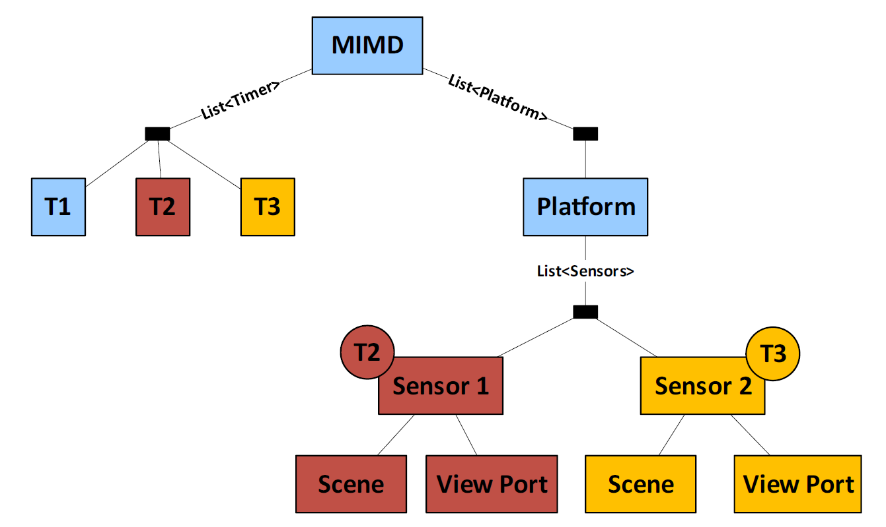

=== Temporal Reference Systems

Proposition: Time is in the eye of the beholder.  So all measurements of time must be local.

Dynamic Features are not tied to an Earth-centered static existance. Yet the concepts of time used in the geospatial community are almost exclusivly based on Earth-centric astronomical phenomena. They also assume a rather coarse degree of granularity. For dynamic features we need to use local clocks with precision down to the nanosecond. We are less concerned with absolute time than with relative time. State B was achieved 37 nanoseconds after State A.  

It's only when we begin aggregating these dynamic elements that we begin to worry about "absolute" time. Even then, we are more likely to convert from one local clock to another then to convert to an absolute time. 

So if all time is local, we need a Temporal Reference System concept which captures the parameters needed to transform across TRSs. A temporal equivalent to GeoPOSE.

==== MISB Timers

Timing is critical for motion imagery. Not only are accurate time stamps essential for the smooth viewing of the images, they are even more critical for the accuracy of data derived from that imagery. Proper geolocation of a moving image, for example, requires nano-precision time stamps.

For that reason, the Motion Imagery Standards Board (MISB) developed a timing infrastructure for use with MISB standards. This infrastructure addresses not only the locality of time, but also the conversion of time values from one locality to another.

Three timers are illustrated in the example below (T1, T2, and T3). T1 is associated with the Platform. This timer receives regular GPS updates and is considered the most accurate in this system. T2 is associated with Sensor 1. This is a simple oscillator, counting nanoseconds since the sensor was last powered up. T3 is associated with Sensor 2. It also is a simple oscillator.  

While timers T2 and T3 are sufficient for the operation of their associated sensors, data based on time values from these Timers would not be usable. A transformation from the local time to global time is required.

image::images/MISB_Timer.png[]

Discussion of Timers and how their attributes are used to build a mesh of TRS - similar to GeoPOSE.

==== Temporal Schema

The ISO standard covering temporal reference sysems is ISO 19108:2002 Geographic Information - Temporal Schema.

Discuss Calendars and clocks

Local vs "Global" clocks

POSIX time is tied to a global datum, a calendar. 

Local time is tied to a local counter. 

Analogous to a Spatial Reference System vs. an Engineering CRS.

Extending TM_Clock and/or TM_coordinateSystem
